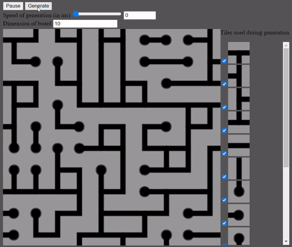

# wave-function-collapse

I saw a video that talked about **wave function collapse** in video games

I wanted to try it myself and the challenge was to do it without any tutorials or help



This project was not focused on estethics but more on the algorithmic part

## How to use

Clone the repo
```
git clone git@github.com:filveith/wave-function-collapse.git
```
And then just open the HTML file in your browser or with live share on vs code

You can play around with the settings of the generation

You can:
- select which tiles are used in the generation
- the amount of tiles in the board
- the speed of the generation
